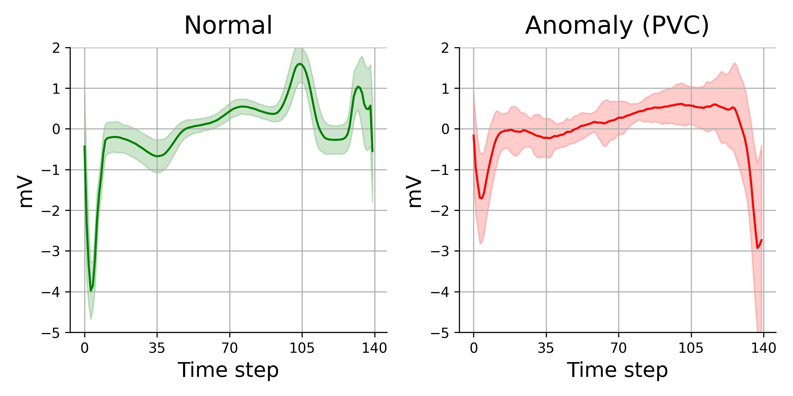
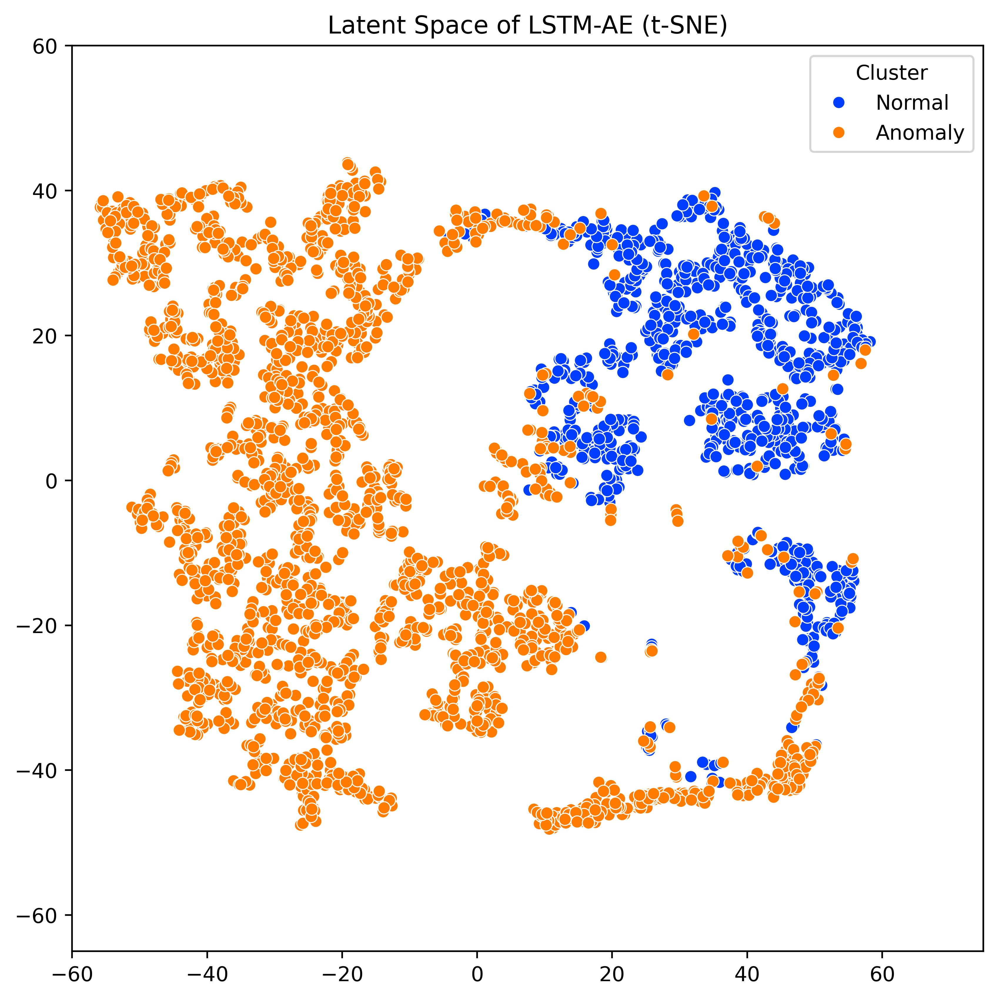
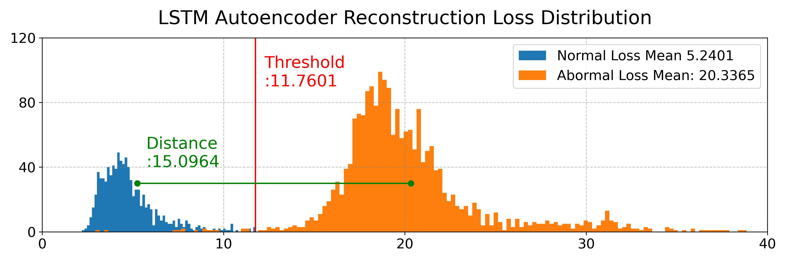
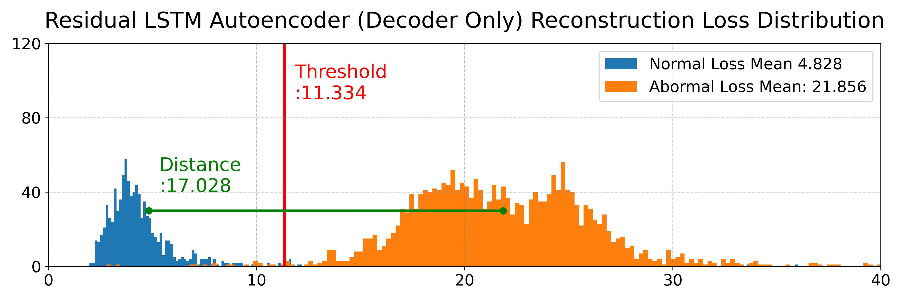
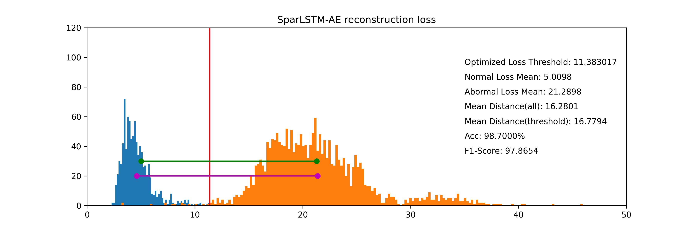
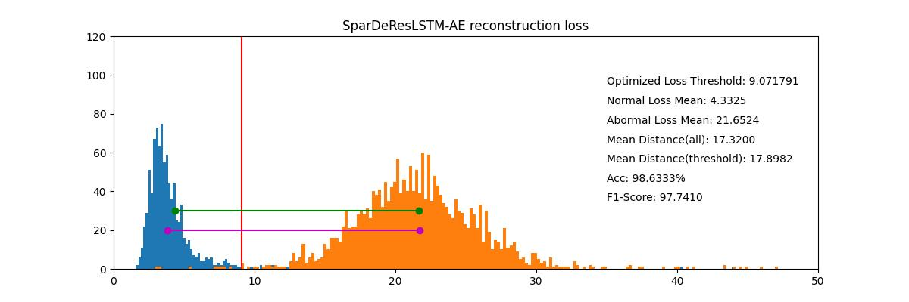

# SRL-AE
* <i>SRL-AE (<u><b>S</b></u>parse <u><b>R</u></b>esidual  <u><b>L</u></b>STM <u><b>A</u></b>uto<b>e</b>ncoder)</i>
* Accepted, but not published yet.
* <code>README.md</code> will be completed soon.

## Dataset
* <a href="https://www.timeseriesclassification.com/description.php?Dataset=ECG5000">ECG5000 Dataset</a>

## Experiment 1 (Residual LSTM)

|  | Accuracy | F1-Score | Normal Loss Mean | Loss Gap |  
| :---: | :---: | :---: | :---: | :---: |
| Both | 0.983 | 0.972 | 5.208 | 16.003 |
| Encoder | 0.954 | 0.923 | 6.980 | 15.914 |
| Decoder | <b><u>0.986</b></u> | <b><u>0.977</b></u> | <b><u>4.828</b></u> | <b><u>17.028</b></u> |

## Experiment 2 (Sparse Autoencoder)
 | 
--- | --- |

## Experiments

|  | Accuracy | F1-Score | Normal Loss Mean | Loss Gap |  
| :---: | :---: | :---: | :---: | :---: |
| LSTM-AE | 0.986  | 0.978 | 5.240 | 15.096 |
| Residual LSTM-AE | 0.986 | 0.977 | 4.828 | 17.028 |
| Sparse LSTM-AE | <u><b>0.987</b></u> | <b><u>0.979</u></b> | 5.010 | 16.280 |
| SRL-AE (Ours) | 0.986 | 0.977 | <b><u>4.332</u></b> | <b><u>17.320</u></b> |

 | 
--- | --- |
 | 

## References
1. Hou, Borui, et al. "LSTM-based auto-encoder model for ECG arrhythmias classification." IEEE Transactions on Instrumentation and Measurement 69.4 (2019): 1232-1240.
2. Farady, Isack, et al. "ECG Anomaly Detection with LSTM-Autoencoder for Heartbeat Analy
sis." 2024 IEEE International Conference on Consumer Electronics (ICCE). IEEE, 2024.
3. Dutta, Koustav, et al. "MED-NET: a novel approach to ECG anomaly detection using LSTM auto-encoders." International Journal of Computer Applications in Technology 65.4 (2021): 343-357.
4. Matias, Pedro, et al. "Robust Anomaly Detection in Time Series through Variational AutoEncoders and a Local Similarity Score." Biosignals. 2021.
5. Alamr, Abrar, and Abdelmonim Artoli. "Unsu pervised transformer-based anomaly detection in ECG signals." Algorithms 16.3 (2023): 152.
6. ECG5000-Dataset, “http://timeseriesclassification.com/description.php?Dataset=ECG5000,“ Access Date: 2024/08/23.
7. Wei, Yuanyuan, et al. LSTM-autoencoder-based anomaly detection for indoor air quality time-ser ies data." IEEE Sensors Journal 23.4 (2023): 3787-3800.
8. Kim, Jaeyoung, Mostafa El-Khamy, and Jung won Lee. "Residual LSTM: Design of a deep recurrent architecture for distant speech recognition." arXiv preprint arXiv:1701.03360 (2017).
9. Ng, Andrew. "Sparse autoencoder." CS294A Lecture notes 72.2011 (2011): 1-19.